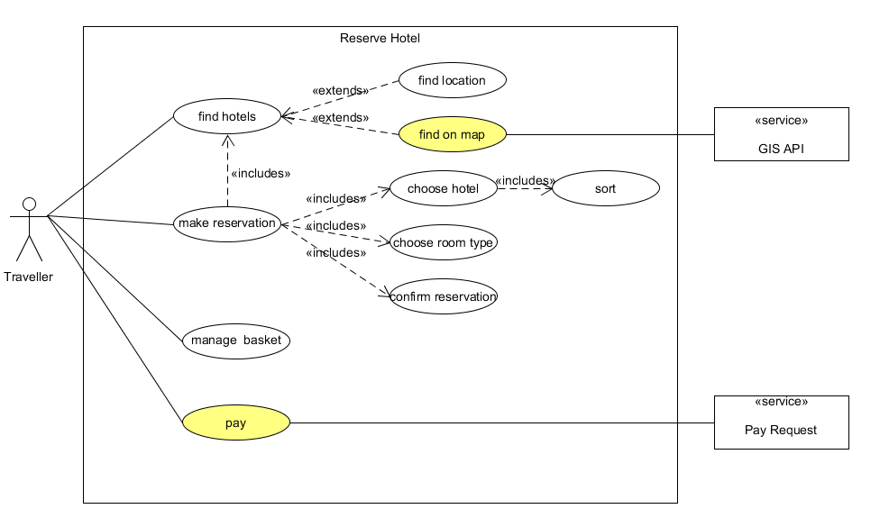

 在没有接触大项目之前，仅仅是知道需求分析的重要性，但没有学习如何分析需求。这就好像是我知道飞机会降落，但不清楚飞机降落队列和起飞、降落调度一样。了解到用例建模后，能明白用例建模对于详细需求分析的重要性，也理解了在团队项目中建立用例模型的重要性。这篇文章将这几周对用例建模的学习经验进行整理。

### 1. 需求分析和用例
 
#### 1.1 软件需求规约
 
 首先来看一下传统的需求表述方式——“软件需求规约”SRS。传统的软件需求规约基本上采用的是功能分解的方式来描述系统功能，在这种表述方式中，系统功能被分解到各个系统功能模块中，我们通过描述细分的系统模块的功能来达到描述整个系统功能的目的。一个典型的软件需求规约可能具有以下形式：

 

 采用这种方法来描述系统需求，非常容易混淆需求和设计的界限，这样的表述实际上已经包含了部分的设计在内。由此常常导致这样的迷惑：系统需求应该详细到何种程度？一个极端就是需求可以详细到概要设计，因为这样的需求表述既包含了外部需求也包含了内部设计。在有些公司的开发流程中，这种需求被称为"内部需求"，而对应于用户的原始要求则被称之为"外部需求"。

 由此看来，需要寻找一种新的方法来需求分析，这就引出了用例建模。

### 2. 如何编写用例

 - 确定一个功能
 - 写一个用例
 - 用例形式：
   - 文本用例
   - 用例图

### 3. 文本用例

RUP中提供了用例规约的模板，每一个用例的用例规约都应该包含以下内容：

 - 简要说明 (Brief Description) 

  简要介绍该用例的作用和目的。

 - 事件流 (Flow of Event) 

包括基本流和备选流，事件流应该表示出所有的场景。

 - 用例场景 (Use-Case Scenario) 

包括成功场景和失败场景，场景主要是由基本流和备选流组合而成的。

 - 特殊需求 (Special Requirement) 

描述与该用例相关的非功能性需求（包括性能、可靠性、可用性和可扩展性等）和设计约束（所使用的操作系统、开发工具等）。

 - 前置条件 (Pre-Condition) 

执行用例之前系统必须所处的状态。

 - 后置条件 (Post-Condition) 

用例执行完毕后系统可能处于的一组状态。
### 4. 用例图

文本用例详尽地将用例描述出来，在交付用例制品时，用例图能够更好地理清用例之间地关系，能够简单地给出一个或一组用例地概要，但是用例图并不是描述用例定义书写格式的标准。系统建模语言为UML，UML是英文Unified Modeling Language的缩写，中文称为统一建模语言或标准建模语。轻量级的UML画图工具为[UMLet](http://www.umlet.com/changes.htm) 。通过此网站可以下载UMLet稳定版本。

#### 4.1 识别Actors

 - 用Actor的符号表示，通常放在系统的左边
 - 外部系统通常用neighborSystem的符号表示，注意，大而全的软件是失败的。

#### 4.2 识别use case(服务)

 - 识别用户级别用例
 - 识别子功能级别用例
 - 识别子功能级别用例之间的关系
  	- `<<include>>`,表示子用例是父用例的一部分，通常强调离开这个特性，父用例无法达成目标或失去意义！箭头指向子用例
  	- `<<extend>>`,表示子用例是父用例的可选场景或技术特征。箭头指向父用例

#### 4.3 Actor和use case之间的关系

 - 使用无方向连线，表示两者之间是双向交互的协议

### 5. 使用用例模型的优点和缺点

#### 5.1 优点

 用例方法完全是站在**用户**的角度上（从系统的外部）来描述系统的功能的。在用例方法中，我们把定义的系统看做一个黑盒，编写用例时并不需要关心系统内部是如何实现这些功能，因此用例方法可以将注意力放在需求上，将需求与设计分离开来。在面向对象的分析设计中，用例模型主要用于表述系统的功能性需求，系统的涉及主要由对象模型来记录表述。因此用例模型可以更清晰地将软件需求抽丝剥茧，达到更好的效果。

 另外，在RUP中，用例是作为整个软件开发流程的**基础**，在软件生命周期的六个阶段（需求分析、设计、代码编写、调试、软件测试、维护）都需要围绕用例进行。特别是软件测试中，需要根据用例来对目标系统进行测试，可以根据用例中所描述的环境和上下文来完整地测试一个系统服务，可以根据用例的各个场景(Scenario)来设计测试用例，完全地测试用例的各种场景可以保证测试的完备性。

#### 5.2 缺点
 编写用例需要遵循严谨的规范，在一些小型软件中，使用用例建模会降低其开发效率。

 在互联网产品和设计中，用例的使用越来越少，通常有了产品原型再加上功能流程图和功能说明文档就能够将产品需求详细的表述清楚，所以也没有必须撰写用例了。但是在大公司里，往往会追求产品流程的规范性，要求撰写用例，不过在敏捷开发的时候也会采用其它更有效率的方式，不一定非要撰写用例。

### Reference
1. 潘老师课件
2. [IBM用例建模指南](https://www.ibm.com/developerworks/cn/rational/r-usecase-atm/)
3. [人人都是产品经理 第四章：产品设计(2.4)PRD写作 – 用例模型(产品用例图)](http://www.woshipm.com/pd/114490.html)
